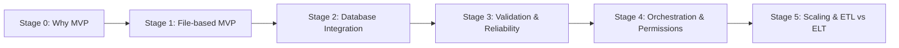

# From Math to Data Engineering  
*A Hands-on ETL Learning Journey*

> 🚧 **Status Note**  
> Stage 0 (Why MVP) has been completed ✅.  
> I’m currently focusing on **foundational programming training**,  
> following my [Foundational Training Plan](./docs/methodology/en/00_foundational_training_plan.md)  
> and [Practical Modules Training](./docs/methodology/en/01_practical_modules_training.md).  
>  
> Once the core skills are solidified, I’ll move on to **Stage 1 (File-based MVP)**  
> to begin building the first working ETL flow.

---

This repository documents my journey of learning ETL/ELT step by step.  
Built after just **two months of self-learning with AI assistance**, it evolves from the simplest MVP to more advanced, production-like features.  

The goal is to make the **evolution of data engineering practices** explicit and easy to follow.

---

## Core vs Enablers
I see data engineering as built around two essential layers:  

- **Core (the essence):** Data transformation itself — the heart of ETL/ELT.  
- **Enablers (the safeguards):** Validation, orchestration, permissions, monitoring. They don't alter the core logic, but they ensure the pipeline is reliable, maintainable, and scalable.  

👉 For the detailed philosophy behind this framework, see [docs/philosophy.md](./docs/philosophy.md).

---

## Project Stages
- **Stage 0: Why MVP (Mindset) ✅** → [docs/learning_journey/en/stage0_mindset.md](./docs/learning_journey/en/stage0_mindset.md)  
- **Stage 1: Core MVP (File-based) (in progress)** → Prove a minimal ETL flow is viable using only files.  
- **Stage 2: Database Integration & Modularity (planned)** → Transition to database-driven ETL and split code into modular components.  
- **Stage 3: Enablers — Validation & Reliability (planned)** → Add data validation, idempotency, and logging for robustness.  
- **Stage 4: Enablers — Orchestration & Permissions (planned)** → Introduce Docker, scheduling, and role-based access.  
- **Stage 5: Scaling & ETL vs ELT (design + local PoC) (planned)** → Outline a benchmarking method, run a local proof-of-concept, and prepare for re-run on a cloud data warehouse.

---

## Roadmap

- [x] Stage 0: Why MVP (documented in [docs/learning_journey/en/stage0_mindset.md](./docs/learning_journey/en/stage0_mindset.md))  
- [ ] Stage 1: File-based MVP  
- [ ] Stage 2: Database integration  
- [ ] Stage 3: Data validation + idempotency  
- [ ] Stage 4: Orchestration + permissions  
- [ ] Stage 5: Scaling + ELT comparison  

## 📊 Visual Roadmap 

---

## Planned Development 

As of **September 2025**, Stage 0 (Why MVP) has been completed and documented.  
The immediate next milestone is **Stage 1: Core MVP (File-based)**.  

Upcoming milestones:  
- Build the first local MVP pipeline (file-based)  
- Migrate outputs into a database (Postgres)  
- Add validation, idempotent writes, and logging  
- Introduce containerization and orchestration with Airflow  
- Experiment with scaling to larger datasets  
- Prepare for eventual migration to a cloud data warehouse  

The long-term goal is to evolve this into a **cloud-ready data pipeline**, while keeping the philosophy of logical, minimal, and purposeful design.

---

## Why This Repo Exists

This project is more than just code.  
It documents the **learning journey** of someone with a mathematics background,  
who decided to explore data engineering and build an ETL pipeline from scratch.  

- For myself: it serves as a record of growth, decisions, and mistakes learned along the way.  
- For others: It’s a testament that you don’t need years of experience to start building. You can begin small, question everything, and incrementally build towards more complex systems.

If you are also learning ETL, or transitioning from another field,  
I hope this repo provides a reference point — and maybe the encouragement to start your own journey.  

---

## Author’s Note: Why a "Second Round"?

My first project successfully demonstrated the concept of an ETL pipeline. However, upon completion, I realized that most of the code was provided by AI. Although I understood what the code did, I lacked the 'implementation fluency' that only comes from building it yourself. 

This second iteration is my attempt to bridge the gap between conceptual understanding and true internalization. The **core insights and frameworks remain the same**, as they came from genuine problem-solving. But now, I'm translating them into cleaner code and deeper technical understanding.

This second iteration focuses on:  
- Translating my architectural understanding into cleaner code  
- Deepening my hands-on experience with each component  
- Documenting not just what I built, but **why I made each design choice**  
 
---

## License

This project is licensed under the MIT License. See the [LICENSE](./LICENSE) file for details.

---

## 🤝 Contributing
Contributions, feedback, or suggestions are always welcome.  
See [CONTRIBUTING.md](./CONTRIBUTING.md) for details on guidelines and project structure.  
Even small typo fixes or documentation improvements are appreciated!

---

## 📘 Explore the Docs

If you’re curious about the deeper story and thought process behind this project,  
the `docs/` folder contains a structured record of how everything evolved:

- **[Philosophy](./docs/philosophy.md)** — The core mindset and reasoning model behind every design decision.  
- **[Insights](./docs/insights/README.md)** — A collection of “Aha!” moments and engineering reflections.  
- **[Methodology](./docs/methodology/README.md)** — My self-engineering framework, training plans, and meta-learning approach.  
- **[Learning Journey](./docs/learning_journey/README.md)** — Stage-by-stage documentation of how theory translated into implementation.  

Each section captures a different dimension — from abstract reasoning to concrete execution —  
together forming the full picture of how *math became engineering practice*.

---
### Connect with me
- LinkedIn: [Yenhua Chen's LinkedIn](https://www.linkedin.com/in/yh-Chen-data)

