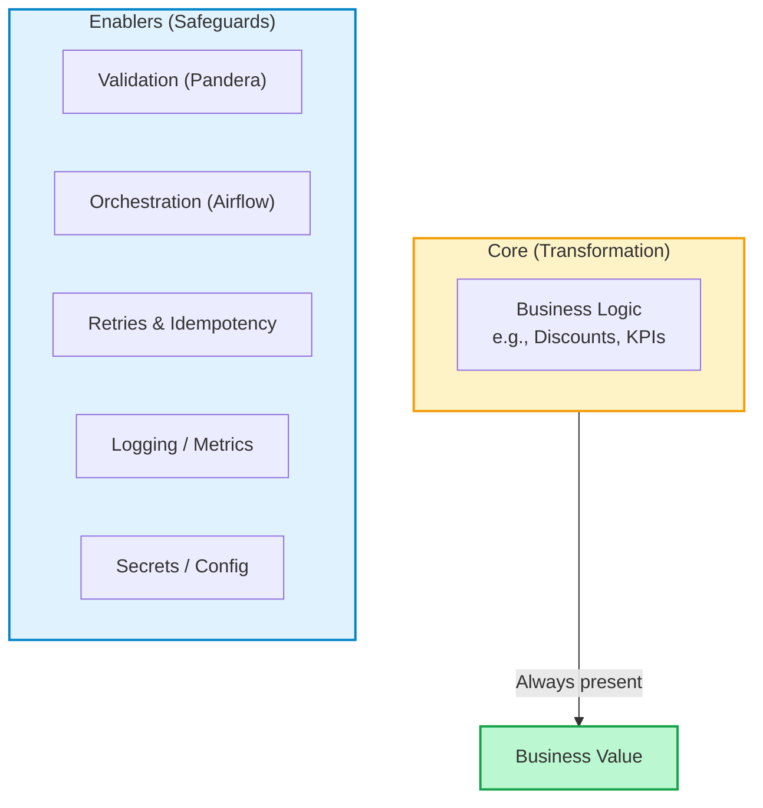
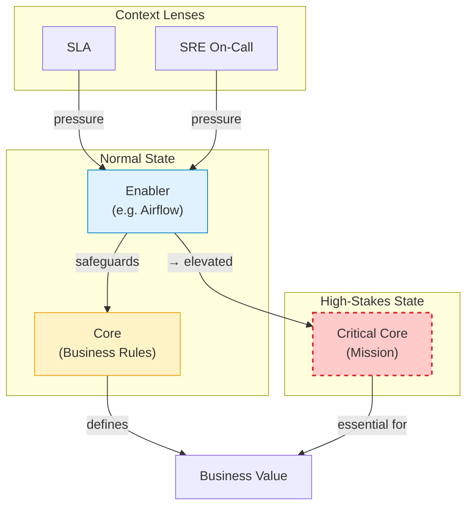

# 01B — The Architect's Toolkit: A Dynamic View of Core vs. Enablers
*(2025-09-27)*
> [Switch to Chinese Version / 跳至中文版](../zh/01B_core_vs_enablers_dynamic.md)

## 📌 Why This Add-on Exists
This file is a **direct extension** of [01_airflow_and_debugging](./01_airflow_and_debugging.md).  
In 01, I realized that all tools either **perform the work (Core)** or **protect the work (Enablers)**.  
But in practice, the line is not fixed. Depending on the context, some Enablers can be promoted to Core.  

This add-on captures that **dynamic view** — turning Core vs. Enablers from a static model into a **diagnostic toolkit**.

---

## 🌀 Static View: Core vs. Enablers (Baseline)

### Interpretation:

- **Core** = transformation logic that defines the business meaning.

- **Enablers** = safeguards that protect correctness, observability, reliability, and security.

- This is the **entry-level definition** (the “doorway”).

---

## 🔍 Lenses for Evaluation
Instead of asking “Is this Core or Enabler?” once and for all,  
I now ask it through **different lenses**:

| Lens (視角) | Core Question (核心問題) | Example (範例) |
|-------------|---------------------------|----------------|
| **1. MVP Definition** | Does this deliver the essential value for this stage? | Prototype ETL → only transformation is Core. Production ETL → Pandera validation is Core (data quality = business value). |
| **2. Job Role** | Am I thinking like an Architect (logic) or SRE (runtime)? | Architect sees Airflow as Enabler. SRE on-call 3AM sees Airflow as Core. |
| **3. Delivery Requirement (SLA)** | Does the SLA make this non-negotiable? | If SLA requires daily 7AM report, automation (Airflow/Prefect) is promoted to Core. |
| **4. Logic Domain** | Is this solving a Business Problem or Engineering Problem? | SQL discount rule = Business Core. DB retry logic = Engineering Enabler. |
| **5. Cost Attribution** | Does the cost scale with business volume or is it fixed? | Processing 10M rows = Core (scales with volume). Monitoring = Enabler (fixed cost). |

---

### ⚡ Dynamic View: Promotion Under Pressure

### Interpretation:

- Under **normal state**, Enablers are just safeguards.

- Under **contextual pressures** (SLA, SRE on-call emergencies), Enablers may be elevated to **Critical Core**.

- This shows why the framework is not static — it adapts to roles, contracts, and stakes.

## 🛠 Engineering Heuristics
- **If removing it changes the business meaning → Core**  
- **If removing it doesn’t change meaning but hurts safety/reliability → Enabler**  
- **If an SLA depends on it → promoted to Core**  
- **If you’re on-call at 3AM → everything breaking feels like Core**  

---

## 🗝 Takeaway
The binary definition (Core vs. Enabler) is the **doorway**.  
But in real systems, you need to **switch between lenses**: MVP, Role, SLA, Logic, Cost.  

👉 This transforms the model into a **diagnostic toolkit** you can actually use:  
- **Design stage** → Architect lens  
- **On-call stage** → SRE lens  
- **Contract/SLA stage** → Delivery lens  
- **Logic clarity** → Business vs. Engineering lens  
- **Cost review** → Attribution lens  

---

## 🔗 Connection Back to 01
This file exists because Airflow forced me to see the **Core never changed** (data transformation),  
but everything else — retries, orchestration, validation — shifted roles depending on context.  

That is why Core vs. Enablers is not a rigid wall, but a **dynamic framework in motion**.  

---