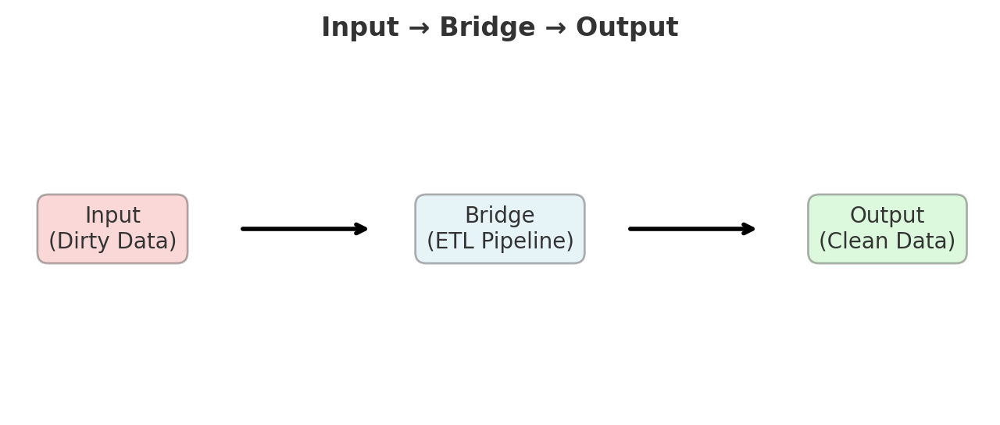

# 🌪️ From Airflow Struggles → 💡 The Debugging Aha! → Core vs Enablers 
> [Switch to Chinese Version / 跳至中文版](../zh/01_airflow_and_debugging.md)

## The Airflow Reality Check
*(2025-09-07)*

After struggling with Airflow configuration for a full day (parameters, environment setup, endless errors), I almost gave up.  
When it finally worked, a realization clicked:

> **“Wait… this is just my local ETL with extra steps?”**

Looking deeper at the code structure, I realized:
- Airflow = **Scheduler + Monitor + Python executor**  
- My **core transformation logic remained unchanged**  
- The real value lies in **automation and observability**, not in transformation itself  

**Mathematical insight**: Strip away the complexity, and you find the same fundamental operations.  
The tool changes the **execution environment**, not the **computational essence**.

**Key learning**: Always ask “**what is the irreducible core?**” before getting lost in tooling complexity.

---

## 💡 The Debugging “Aha!” Moment: From Frustration to System Thinking
*(2025-09-06)*

After hours of debugging a stubborn issue, I was ready to give up.  
Walking to get dinner, it suddenly hit me:

**Programming is just building a bridge between input and desired output.**

### A Shift in Perspective
Instead of getting lost in implementation details, I realized I should always clarify:
- What exactly is my **input**?  
- What exactly do I want as **output**?  
- What’s the **simplest path** between them?  

This mental model scaled from debugging individual functions to designing entire ETL systems:

Data Engineering = Input (dirty data)
→ Bridge (ETL pipeline)
→ Output (clean, analysis-ready data)


### Stepping Back for Clarity
Sometimes the best insights don’t come from staring at code,  
but from stepping back and asking: **“What am I actually trying to accomplish?”**  

This way of thinking didn’t appear out of thin air — it was triggered by frustration and reflection.  
The shift came suddenly, but it was grounded in prior struggles, making the insight both objective and reliable.


### Mathematical Connection
This input–process–output framework is just **f: X → Y**.  
Clarity comes from:
- Defining the **domain (input space)**  
- Defining the **codomain (desired output space)**  
- Then finding the **transformation** that maps between them  

What began as a debugging insight evolved into a universal framework for **system thinking**.

---

##  The “Aha!” Moment — Core vs Enablers Born
*(2025-09-07)*

After wrestling with Airflow’s complexity, a broader pattern emerged:

- **The Core never changed** — data transformation logic remained identical whether running locally or in Airflow.  
- **Everything else was an Enabler**:  
  - **Airflow** → enables scheduling & monitoring  
  - **Pandera** → enables data structure validation  
  - **Unit tests** → enable logic validation  
  - **Secrets/Env** → enable secure configuration  
  - **Logging/Metrics** → enable observability  
  - **Idempotent writes & retries** → enable reliability  

**Unified insight**: All tools either **perform the work** (*Core*) or **protect the work** (*Enablers*).


### Decision Checklist
1. Does this step **change the business meaning**? (Yes → Core; No → Enabler)  
2. If removed, would the **output values change**? (Yes → Core; No → Enabler)  
3. Is the purpose **validation / observability / scheduling / security / resilience**? (Yes → Enabler)  

> 📌 Suggested diagram:  
> – center = Core, outer blocks = Enablers.

### 💡 Important Note:  
The distinction between Core and Enabler is not absolute. As projects scale, teams grow, or system stability demands increase, what was once considered an “Enabler” — such as workflow orchestration or access control — may become **Core** in a new stage because of its critical impact on reliability and maintainability.  

---

## 🔧 Bridge-in-Code: Mapping Core vs Enablers to ETL Pipelines

### Core (changes business meaning)
- **Normalization & cleaning**: unit/currency conversion, timezone alignment, field standardization  
- **Rules & derivations**: tax/discount/classification rules, surrogate keys  
- **Aggregation & metrics**: groupby, window functions, KPIs (AOV, conversion rate)  
- **Semantic deduplication**: defining what counts as “the same order” 

### Enablers (don’t change meaning, ensure correctness)
- **Schema Validation** (Pandera/pydantic): types, uniqueness, ranges, foreign key shape  
- **Quarantine & rejects**: isolate bad rows with reasons, prevent silent data loss  
- **Idempotent writes**: `_tmp` → atomic rename, batch upserts, dedup locks  
- **Retries/backoff/timeouts**: for I/O and external service stability  
- **Logging & metrics**: counts in/out, rejects, latency, SLA/SLO  
- **Config/Secrets**: `.env` / vault; DB roles with least privilege  
- **Orchestration**: Airflow/DAG scheduling, dependencies, notifications, re-runs  
- **Testing**: unit, integration, contract/schema snapshots  

---

### Minimal ETL Skeleton
```python
def extract(src):
    # Enabler: retries/backoff, logging
    return read_raw(src)

def parse_and_normalize(df):
    # Core: normalization, unit/timezone conversion, semantic alignment
    return normalized_df

def transform_business_rules(df):
    # Core: business logic (tax, discounts, categorization), metrics
    return metrics_df

def validate(df):
    # Enabler: schema checks (no semantic change, only filter/quarantine invalid rows)
    return good_df, rejected_df

def load(df, table, conn):
    # Enabler: idempotent write (_tmp → rename), retries, audit logging
    atomic_write(df, table, conn)

def pipeline():
    raw = extract("raw_path")
    good, bad = validate(parse_and_normalize(raw))
    result = transform_business_rules(good)
    load(result, "silver.metrics_daily", conn="RO_LEAST_PRIV")

Quick Heuristic
If removing a step changes the business output values, it’s Core.
If removing a step doesn’t change meaning but removes safety, observability, or reliability, it’s an Enabler.
```

---

## 📎 Further Reading

To explore how Core vs. Enablers can dynamically shift under different contexts,  
see [01B_core_vs_enablers_dynamic](./01B_core_vs_enablers_dynamic.md) — *The Architect's Toolkit: A Dynamic View of Core vs. Enablers*.
