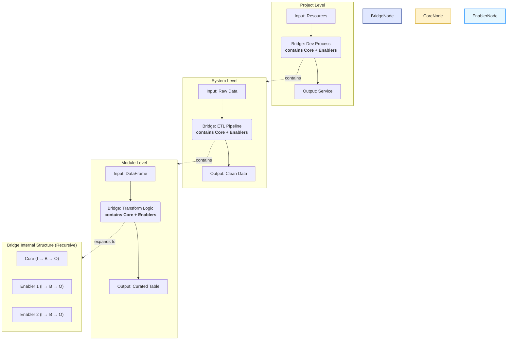
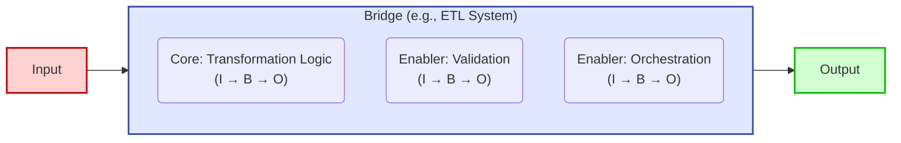
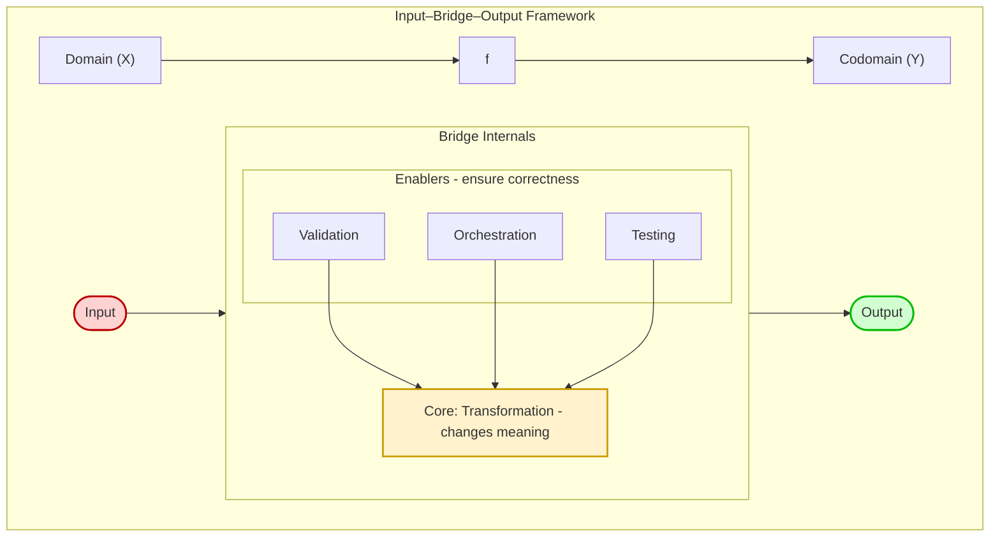

# From a Single Function to the Entire System: A Fractal Philosophy
> [Switch to Chinese Version / 跳至中文版](../zh/03_function_as_model.md)

## The Spark: A Tale of Two "Functions" (「函式」vs. 「函數」)
*(2025-09-23)*

I once came across an interesting discussion online:  
How should we translate *function* into Chinese — **「函式」** or **「函數」**?

- **函數 (hánshù)** carries the mathematical meaning of a pure mapping: *Domain → f → Codomain*.  
- **函式 (hánshì)** feels more like a block of functionality in programming.

This subtle difference triggered me to think:  
Does my **Input–Bridge–Output** framework correspond to a small function inside a program,  
or is it closer to the entire script?

---

### A Shift in Understanding

I realized: the **entire script itself is a function**.  
It also fits the mathematical structure:

- **Input**: resources, data, conditions  
- **Bridge**: the script’s processing logic  
- **Output**: results, deliverables  

Even more importantly, this pattern is **recursively nested** — like a Russian Matryoshka doll:

- **A Project** is a giant function:  
  *Input (people/time) → Bridge (development process) → Output (deliverables)*  
- **A System** is also a function:  
  *Input (raw data) → Bridge (ETL pipeline) → Output (clean data)*  
- **Modules / Scripts / Functions** follow the same pattern, layer after layer.

---

## Unified Insight: Core × Enablers are Functions Too

At every layer, the **Bridge** can be further decomposed into **Core** and **Enablers**:

- **Core** = the processing logic that directly creates value  
- **Enablers** = the guardians that ensure the Core runs reliably (validation, logging, monitoring…)

The deeper insight is: **Enablers themselves also follow Input–Bridge–Output**.  
Examples:

- **Pandera Validation**:  
  *Input (dataframe) → Bridge (validation rules) → Output (pass / reject)*  
- **Unit Test**:  
  *Input (test data) → Bridge (test logic) → Output (pass / fail)*  

Thus, neither Core nor Enabler is an exception — both are roles within the same universal model.

---

## The Practical Payoff

This insight helped me build a unified design philosophy:  
**Function as a Thinking Model**.  

It brings three tangible benefits:

1. **Clarity at Any Scale**  
   I can zoom in and out — from a single line of code to the architecture of an entire project —  
   while always using Input–Bridge–Output as the language of description.

2. **Predictable Design**  
   When designing new features, I first define the I/O (Core),  
   then consider which Enablers (tests, validations, monitoring) are needed.  
   This creates a disciplined, repeatable design process.

3. **Efficient Debugging**  
   When something breaks, I can quickly locate the issue:  
   Did the error happen at the Input, the Output, or inside the Bridge?  
   If it’s the Bridge, was it the Core logic that failed, or one of the Enablers?

---

## ✅ One-Sentence Summary

This exploration began with a subtle linguistic distinction—between a function as a block of code and a function as a mathematical mapping. It led to a profound realization: a function isn't merely a unit of syntax, but a **recursively applicable mental model**.

- **Input–Bridge–Output** forms the skeleton.  
- **Core vs Enablers** provides the flesh.  

Together, they constitute my unified design methodology.

---