# The Map is Not the Territory: A Dynamic Approach to System design
> [Switch to Chinese Version / 跳至中文版](../zh/04_unified_philosophy.md)

## A Unified Design Philosophy
*(2025-09-24)*

Starting from a subtle distinction — *hánshì* (function as a program block) vs. *hánshù* (function as a mathematical mapping) —  
I realized something powerful:
a function is not just a syntactic unit...

```mermaid
graph LR
    subgraph Static["Static Blueprint (Blueprint)"]
        Map[📜 Map<br>Goals & Structure]
    end

    subgraph Dynamic["Dynamic Navigation (Navigation)"]
        Compass[🧭 Compass<br>Direction & Adjustment]
    end

    Map -->|Provides goals| Compass
    Compass -->|Adapts to reality| Map

    style Static fill:#E6F7FF,stroke:#1E90FF,stroke-width:2px
    style Dynamic fill:#FFF2CC,stroke:#CC9900,stroke-width:2px
    style Map fill:#FFFFFF,stroke:#1E90FF,stroke-width:1.5px
    style Compass fill:#FFFFFF,stroke:#CC9900,stroke-width:1.5px
```

---

### Real-World Chaos and the Three Disturbances  

Reality is never that clean. Projects often start with fuzzy inputs: incomplete requirements, uncertain data, conflicting conditions.  
Sometimes the output shifts: targets move, scopes change, delivery standards evolve.  
And sometimes the bridge itself collapses: logical errors, broken tests, or systemic failures.  

These three disturbances map directly to three fundamental engineering challenges:  

| Disturbance Source | Real Challenge | Core Engineering Domain |
|--------------------|----------------|--------------------------|
| **Input Disturbance** (fuzzy requirements, conflicting conditions) | Uncertainty in specs and scope | Product management, requirement analysis |
| **Output Disturbance** (shifting goals, scope changes) | Adapting to dynamic business demands | Agile development, project management |
| **Bridge Disturbance** (logic errors, system breakdowns) | Failures after release | Testing & QA, DevOps & SRE |

No matter the source, the truth is the same:  
**We must re-align Input and Output, and then adjust the Bridge (Core + Enablers).**

---

## From Static Blueprint to Dynamic Navigation  

Every disturbance leads to the same iterative loop:  
1. Pause construction, clarify and refine the input.  
2. Confirm the updated output goals, and align with the input.  
3. Adjust the Bridge — Core and Enablers — so the system matches the new reality.  

What looks like chaotic iteration is actually the method at work: extracting order from chaos.  
The **Static Blueprint** provides structure and goals, while **Dynamic Navigation** lets me re-calibrate in the messy unknown.  

---

### Why This Is Not a Rigid Methodology  

Many mistake this as a rigid framework.  
But the essence is not the method itself, but **a mindset that adapts across contexts**.  

- Input–Bridge–Output helps me capture the **skeleton of any process**.  
- Core vs. Enablers helps me decompose the **division of responsibilities inside the system**.  

They are not strict rules, but a **meta-model**.  

> ### 💡 Meta-Model
>
> *A mental navigation system that keeps me clear in chaos, re-aligns reasoning, and restores order quickly.*

---

### Final Takeaway  

**No matter where the disturbance comes from — input, output, or bridge — this meta-model helps restore order.**  
The **Static Blueprint** is the map; the **Dynamic Navigation** is the compass.  
Together, they form my unified design philosophy of *forging order out of chaos*.  

---

