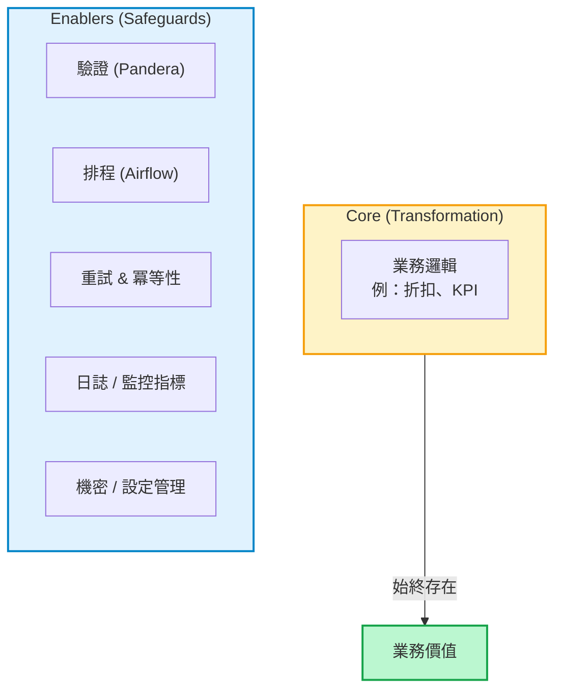
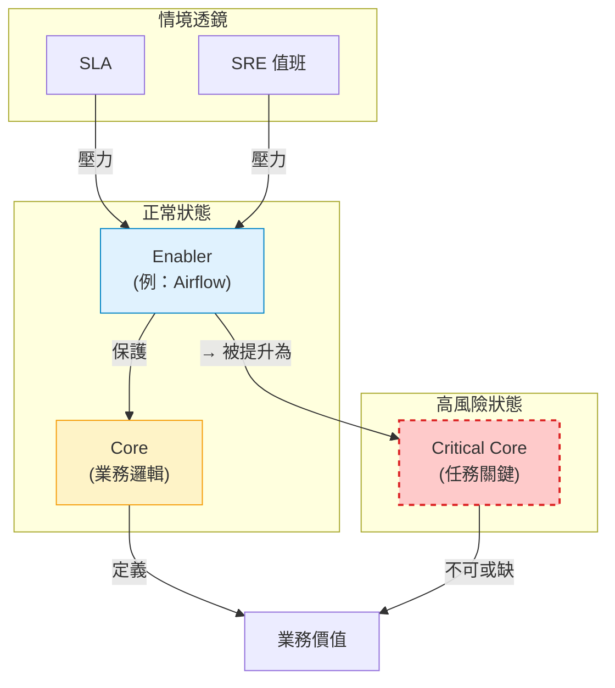

# 01B — 架構師的工具箱：Core 與 Enablers 的動態視角
*(2025-09-27)*
> [Switch to English Version / 跳至英文版](../en/01B_core_vs_enablers_dynamic.md)

## 📌 為什麼會有這份補充檔
這份文件是 [01_airflow_and_debugging](./01_airflow_and_debugging.md) 的**延伸版本**。  
在 01 中，我意識到所有工具要嘛是 **執行工作 (Core)**，要嘛是 **保護工作 (Enablers)**。  
但在實務上，這條界線並不是固定的。在特定情境下，一些 Enablers 會被提升為 Core。  

這份補充檔記錄了這種 **動態觀點** —— 把 Core vs. Enablers 從靜態模型，轉化成一個 **診斷工具**。

---

## 🌀 靜態視角：Core vs. Enablers（基礎版）

### 解讀:

- **Core** = 定義「業務意義」的轉換邏輯。

- **Enablers** = 保證正確性、可觀測性、可靠性與安全性的防護機制。

- 這是**入門級的定義**（進入這個框架的「入口」）。

---

## 🔍 評估的五種視角
與其一次性地問「這是 Core 還是 Enabler？」
更好的方式是透過不同的 **Lens（視角）** 來判斷：

| Lens (視角)         | 核心問題                       | 範例                                                              |
| ----------------- | -------------------------- | --------------------------------------------------------------- |
| **1. MVP 定義**     | 這個元件是否是此階段的核心價值？           | 原型 ETL → 只有轉換是 Core。企業級 ETL → Pandera 驗證變成 Core（因為資料品質 = 業務價值）。 |
| **2. 工作角色**       | 我現在是以架構師（邏輯）還是 SRE（運維）在思考？ | 架構師會把 Airflow 視為 Enabler。凌晨三點值班的 SRE 會把 Airflow 視為 Core。        |
| **3. 交付需求 (SLA)** | SLA 是否讓它變得不可或缺？            | SLA 要求每日早上 7 點產出報表 → 自動化（Airflow/Prefect）被提升為 Core。             |
| **4. 邏輯領域**       | 這是解決業務問題還是工程問題？            | SQL 折扣規則 = 業務 Core。資料庫重試邏輯 = 工程 Enabler。                        |
| **5. 成本歸因**       | 成本是否隨業務量擴大而成長？             | 處理 1,000 萬筆資料 = Core（隨規模擴張）。監控服務費用 = Enabler（固定基礎成本）。           |

---

### ⚡ 動態視角：壓力下的升級

### Interpretation:

- 在 **正常狀態** 下，Enablers 只是保護機制。

- 當面臨 **情境壓力**（例如 SLA、SRE 值班），Enablers 會被提升為 **Critical Core**。

- 這說明了為什麼框架不是靜態的，而是會根據角色、合約、風險動態調整。

## 🛠 工程判斷準則
- **若移除會改變業務意義 → Core**

- **若移除不改變意義，但降低安全性/可靠性 → Enabler**

- **若 SLA 依賴它 → 被提升為 Core**

- **若你凌晨三點值班 → 凡是壞掉的東西都會被視為 Core**

---

## 🗝 Takeaway
Core vs. Enabler 的二分法是**入口**。
但在真實系統中，你必須學會在**不同視角中切換**：MVP、角色、SLA、邏輯、成本。

👉 這會把框架轉化成一個**診斷工具箱**，而不只是抽象概念：
- **設計階段** → 架構師視角

- **運維階段** → SRE 視角

- **合約交付** → SLA 視角

- **邏輯釐清** → 業務 vs. 工程視角

- **成本檢視** → 成本歸因視角 

---

## 🔗 回到 01
這份文件的誕生，來自於 Airflow 帶給我的衝擊：
**Core 從未改變（資料轉換）**，
但其他部分 —— 重試、排程、驗證 —— 會依情境而變化角色。

這也是為什麼 Core vs. Enablers 不是一堵僵硬的牆，
而是一個**隨情境而演進的動態框架**.

---