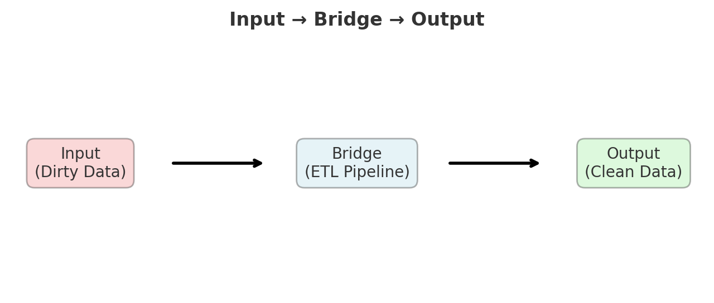
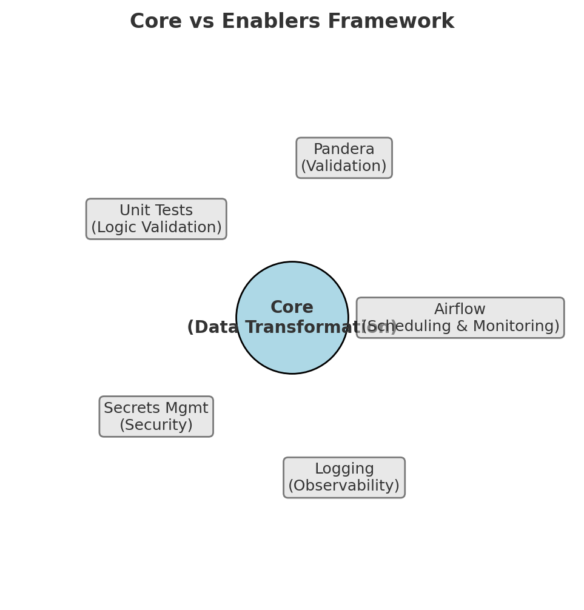

# 🌪️ 從 Airflow 掙扎 → 💡 Debugging 頓悟 → Core vs Enablers
> [Switch to English Version / 跳至英文版](../en/01_airflow_and_debugging.md)

## Airflow 的現實檢驗 
*(2025-09-07)*

在為了設定 Airflow 搞了一整天（參數、環境設置、無盡的錯誤）後，我幾乎要放棄。  
當它終於能運作時，我突然意識到：

> **「等等……這不就是我本地的 ETL，只是多了幾個步驟嗎？」**

更深入地檢視程式架構，我發現：
- Airflow = **排程器 + 監控器 + Python 執行器**  
- 我的 **核心轉換邏輯完全沒變**  
- 真正的價值其實是 **自動化與可觀測性**，而不是轉換本身  

**數學上的洞見**：把複雜性剝掉後，你會發現底層還是相同的運算。  
工具改變的是 **執行環境**，而不是 **計算本質**。  

**關鍵學習**：在陷入工具複雜性之前，先問自己：  
**「不可約的核心是什麼？」**

---

## 💡 Debugging 的「頓悟」：從挫折到系統思維 
*(2025-09-06)*

在調試一個頑固的 bug 好幾個小時後，我快要放棄。  
走去吃晚餐的途中，我突然意識到：

**程式設計其實就是在建一座橋，把輸入轉換成期望的輸出。**

### 視角的轉換
與其迷失在細節，我開始問自己：
- 我的 **輸入** 到底是什麼？  
- 我真正想要的 **輸出** 是什麼？  
- 在兩者之間，**最簡單的橋樑** 是什麼？  

這個心智模型，從 debug 單一函式，一路延展到設計完整 ETL 系統：  


資料工程 = 輸入（髒資料）  
→ 橋樑（ETL pipeline）  
→ 輸出（乾淨、可分析的資料）

### 退一步更清楚
有時候最重要的洞見不是在螢幕前，而是在問自己：  
**「我其實真正要完成的是什麼？」**  

這種思維不是憑空出現的，而是由於長時間的挫折與反思累積出來。  
它來得突然，但同時也很可靠，因為它建立在之前的掙扎之上。

### 數學連結
這個 Input–Process–Output 架構，其實就是 **f: X → Y**。  
清晰來自於：  
- 定義 **domain（輸入空間）**  
- 定義 **codomain（輸出空間）**  
- 找到能把兩者連接起來的 **轉換**  

一開始只是 debug 的小頓悟，最後卻演化成一個通用的 **系統思維框架**。

---

## 「Aha！」時刻 — Core vs Enablers 誕生 
*(2025-09-07)*

在與 Airflow 的複雜性搏鬥後，我看到了更大的模式：

- **Core 從未改變** —— 不論在本地還是 Airflow，資料轉換邏輯都一樣。  
- **其他一切都是 Enabler**：  
  - **Airflow** → 啟用排程與監控  
  - **Pandera** → 啟用資料結構驗證  
  - **Unit tests** → 啟用邏輯驗證  
  - **Secrets/Env** → 啟用安全配置  
  - **Logging/Metrics** → 啟用可觀測性  
  - **冪等寫入與重試** → 啟用可靠性  

**統一的洞見**：所有工具，不是 **執行工作（Core）**，就是 **保護工作（Enablers）**。

### 判斷清單
1. 這一步是否 **改變了業務意義**？（是 → Core；否 → Enabler）  
2. 如果移除，**輸出的數值會不會變**？（會 → Core；不會 → Enabler）  
3. 這一步的目的是否是 **驗證 / 可觀測 / 排程 / 安全 / 穩定性**？（是 → Enabler）  

> 📌 建議圖示:   
> 中心 = Core，外圍區塊 = Enablers。

### 💡 重要提醒：
Core 與 Enabler 的區別並非絕對。  
隨著專案規模擴大、團隊成長、系統穩定性需求增加，  
原本被視為「Enabler」的東西 —— 像是工作流編排或權限管控 ——  
可能在新的階段變成 **不可或缺的 Core**，因為它直接影響可靠性與可維護性。  

---

## 🔧 在程式中橋接 Core 與 Enablers

### Core（改變業務意義）
- **正規化與清洗**：單位/幣別轉換、時區對齊、欄位標準化  
- **規則與衍生**：稅務/折扣/分類規則、代理鍵生成  
- **聚合與指標**：groupby、視窗函數、KPI（AOV、轉換率）  
- **語意去重**：定義什麼才算「同一筆訂單」  

### Enablers（不改變意義，確保正確）
- **Schema 驗證** (Pandera/pydantic)：型別、唯一性、範圍、外鍵形狀  
- **隔離與拒收**：將錯誤列隔離並附理由，避免靜默遺失  
- **冪等寫入**：`_tmp` → 原子改名、批次 upsert、去重鎖  
- **重試 / backoff / timeout**：確保 I/O 與外部服務穩定性  
- **日誌與監控**：輸入/輸出數量、拒收數、延遲、SLA/SLO  
- **設定 / 機密**：`.env` / vault；DB 最小權限角色  
- **編排**：Airflow DAG 排程、依賴、通知、重跑  
- **測試**：單元、整合、契約/schema snapshot  

---

### 最小 ETL 骨架
```python
def extract(src):
    # Enabler: 重試/backoff、logging
    return read_raw(src)

def parse_and_normalize(df):
    # Core: 正規化、單位/時區轉換、語意對齊
    return normalized_df

def transform_business_rules(df):
    # Core: 業務邏輯（稅務、折扣、分類）、指標
    return metrics_df

def validate(df):
    # Enabler: schema 驗證（不改變語意，只過濾/隔離無效列）
    return good_df, rejected_df

def load(df, table, conn):
    # Enabler: 冪等寫入 (_tmp → rename)、重試、稽核日誌
    atomic_write(df, table, conn)

def pipeline():
    raw = extract("raw_path")
    good, bad = validate(parse_and_normalize(raw))
    result = transform_business_rules(good)
    load(result, "silver.metrics_daily", conn="RO_LEAST_PRIV")

# 快速判斷
# 如果移除會改變業務輸出 → Core
# 如果移除不改變意義，但會失去安全/可觀測/可靠性 → Enabler
```
--- 

## 📎 延伸閱讀

想了解 Core vs. Enablers 如何在不同情境下動態轉換，
請參考 [01B_core_vs_enablers_dynamic](./01B_core_vs_enablers_dynamic.md) 架構師的工具箱：Core 與 Enablers 的動態視角
。
