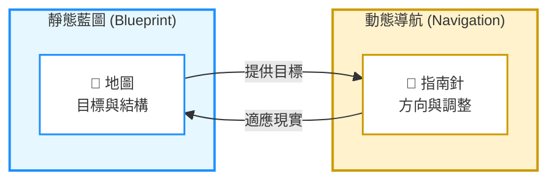
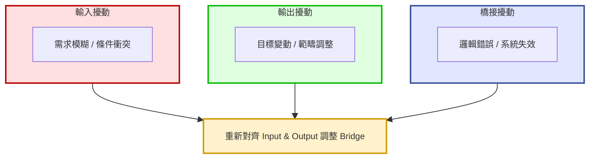
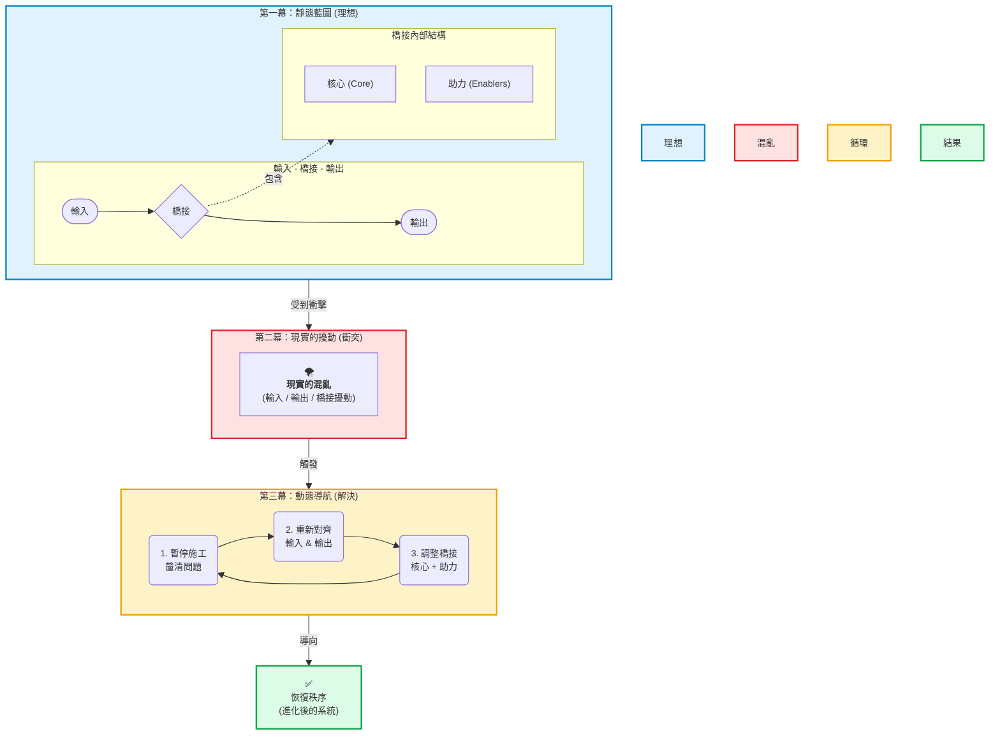

# 地圖不是疆域：系統設計的動態方法
> [切換至英文版 / Switch to English Version](../en/04_unified_philosophy.md)

## 一個統一的設計哲學：從藍圖到現實 
*(2025-09-24)*

從一個細微的差異出發——*函式 (hánshì)*（程式區塊） vs. *函數 (hánshù)*（數學映射）——我得到了一個強而有力的領悟：  
函數不僅僅是語法單位，而是一種 **可遞迴應用的思維模型**。  
**Input–Bridge–Output** 是其骨架，而 **Core vs. Enablers** 是其血肉。  
兩者結合，構成了我理想系統設計的靜態藍圖。  

---

### 現實的混亂與三種擾動  

然而，現實從不如此乾淨。專案往往始於模糊的輸入：需求不完整、資料不確定、條件互相衝突。  
有時則是輸出發生變化：目標轉移、範疇調整、交付標準改變。  
偶爾甚至橋接本身崩壞：邏輯錯誤、測試失效、機制整體崩潰。  

這三種擾動，正好對應工程中的三大挑戰：  

| 擾動來源 | 真實挑戰 | 核心工程領域 |
|----------|------------------|-------------------|
| **輸入擾動**（模糊需求、條件衝突） | 規格與範疇的不確定性 | 產品管理、需求分析 |
| **輸出擾動**（目標變動、範疇調整） | 對動態商業需求的適應 | 敏捷開發、專案管理 |
| **橋接擾動**（邏輯錯誤、系統故障） | 上線後的系統與邏輯失效 | 測試與品質保證、DevOps 與 SRE |

不論擾動來自哪裡，最終都指向同一個真理：  
**我們必須重新對齊輸入與輸出，然後調整橋接（Core + Enablers）。**

---

## 從靜態藍圖到動態導航  

每一次擾動，都會引發一個共同的迭代迴圈：  
1. 停下施工，回去澄清、修正甚至重構輸入。  
2. 確認新的輸出目標，並與輸入對齊。  
3. 調整橋接的 Core 與 Enablers，使整體結構符合更新後的需求。  

因此，看似混亂的開發反覆，其實正是方法在運作：從混沌中抽取秩序。  
**靜態藍圖** 提供目標與結構，**動態導航** 則讓我在不確定的疆域中重新校準路徑。  

---

### 為何這不是僵化的方法論  

許多人誤以為我提出的是一套僵化的框架。  
其實，我的重點並不在方法論本身，而是在於 **一種能靈活適應不同情境的思維方式**。  

- Input–Bridge–Output 幫助我抓住 **任何流程的骨架**。  
- Core vs. Enablers 幫助我拆解 **內部責任的分工**。  

它們不是鐵律，而是一個 **後設模型（meta-model）**。  

> ### 💡 後設模型（Meta-Model）
>
> *一種心智導航系統，讓我在面對混亂時保持清晰，調整推理，並快速找回秩序。*

---

### 最終總結  

**無論擾動源自輸入、輸出或橋接，這個後設模型都能幫助我恢復秩序。**  
**靜態藍圖** 是目的地的地圖；**動態導航** 是穿越未知疆域的指南針。  
兩者結合，構成了我「從混亂中鍛造秩序」的統一設計哲學。  

---

